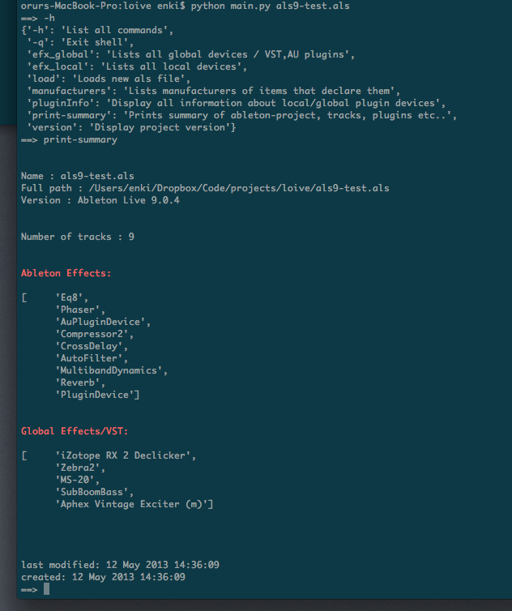

loive
=====

Ableton live project parser

This is all on very early development stage:

Following Michael Garriss great blog post ( http://crooked-hideout.blogspot.com/ ) 

do the following:

	$ cp example.als example.gz
	$ gunzip example.gz
	$ file	example
	example: XML  document text

include XML document in run-folder

I have included this now so all you need to enter is a string to your ableton file

	import loive

	lp = loive.Loive('example.als')

performs copy and gzip, parses the data

NOTE: I think this only works with newer versions of ableton live 8 and above

Dependencies
===========

	etree		--For XML parsing	Link : http://docs.python.org/2/library/xml.etree.elementtree.html
	pprint		--Default			Link : http://docs.python.org/2/library/pprint.html 
	colorama	--color				Link : https://pypi.python.org/pypi/colorama

Shell
======

run:

	python main.py example.als

This will parse information about the live session example.als

	type -h for help

commands

	  -h		 	   :   List all commands
	  -q		 	   :   Exit shell
	  efx_local		   :   Lists all local devices
	  efx_global	   :   Lists all global devices / VST,AU plugins
	  pluginInfo	   :   Display all information about local/global plugin devices
	  version	 	   :   Display project version
	  print-summary    :   Prints summary of ableton-project, tracks, plugins etc..
	  load		 	   :   Loads new als file
	  manufacturers    :   Lists manufacturers of items that declare them 

Class examples:

	import loive

	lp = loive.Loive('lojibeat.als')
	lp.print_summary()

Prints the status of the file, tracks, vst plugins etc..

You can run full paths to ableton project as well:

	lp = loive.Loive('/Users/someuser/path/to/ableton-set.als')

---

	lp.live_version()

returns
		
	[Ableton Live 8.1.3]

Get Plugin info:

	lp.getPluginInfo()

prints

	Ableton Effects: 

	[   'AuPluginDevice',
    	'Compressor2',
    	'Erosion',
    	'PingPongDelay',
    	'OriginalSimpler',
    	'MidiArpeggiator',
    	'Reverb',
    	'DrumGroupDevice']

	Global Effects/VST: 

	['Circle', 'GuitarRig2 FX', 'FM8', 'OhmBoyz']

Tested with Ableton live 8.1.3 and live 9.0.4

screenshot:

